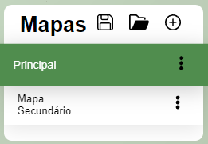

# Tutorial EBGeo

## Página Principal

Na página principal, o tutorial será segmentado em módulos.

* Módulo 1: ferramentas gerais
* Módulo 2: painel lateral esquerdo
* Módulo 3: barra de busca
* Modulo 4: painel lateral superior direito de desenho
* Módulo 5: painel lateral inferior direito de ferramentas auxiliares
* Módulo 6: painel inferior de coordenadas
* Módulo 7: uso do Streetview
* Módulo 8: uso de ferramentas no mapeamento 3D.

### Módulo 1: Ferramentas Gerais

É possível navegar pelo mapa da seguintes formas no computador (nenhuma ferramenta selecionada):

- Botão esquerdo do mouse: ao pressionar e arrastar é possível mover o mapa.
- Ctrl+Botão esquerdo do mouse: ao pressionar e arrastar segurando Ctrl é possível rotacionar e inclinar o mapa.
- Botão direito do mouse: abre as opções de copiar coordenadas e orientar para o norte.
- Botão do meio do mouse: ao rolar o botão do meio do mouse, é possível mudar o zoom do mapa.
- Ctrl+C: Copiar os itens selecionados. É possível selecionar feições, textos e imagens.
- Ctrl+V: Colar as itens copiados.
- Ctrl+Z: Desfazer.
- Ctrl+Y: Refazer.

### Módulo 2: Painel Lateral Esquerdo

<table>
  <tr>
    <td style="vertical-align: top; width: 15%;">
      
    </td>
    <td style="vertical-align: top;">
      <ul>
        <li><strong>Mapas:</strong> ficam centralizadas as opções de importação.</li>
        <li><strong>Camadas:</strong> onde ficam armazenados as camadas.</li>
        <li><strong>Importar:</strong> onde é possível importar arquivos.</li>
        <li><strong>Exportar:</strong> onde é possível exportar uma screenshot.</li>
        <li>Uma aba de acesso rápido, que permite ciclar entre os mapas.</li>
      </ul>
    </td>
  </tr>
</table>

#### Mapas

- Abrir: importar um arquivo .ebgeo, nesse caso, todos os mapas já desenhados são substituídos pelos novos mapas importados no .ebgeo.
- Importar: adicionar um arquivo .ebgeo aos mapas já existentes, nesse caso, são criados novos mapas em adição aos já existentes.
- Salvar: permite escolher quais mapas serão salvos no formato .ebgeo.
- Limpar Tudo: deleta todas as informações armazenadas no navegador, não é possível recuperar.

- É possível adicionar notas a um mapa, com título e informações relevantes que ficam armazenadas no .ebgeo.

- Salvar Posição: a posição atual do mapa é salva, quando o arquivo .ebgeo for aberto em outra máquina ou o mapa for selecionado no painel, a posição central do mapa vai para a posição salva.
- Duplicar: duplicar o mapa atual, para edição em outro mapa com as informações do mapa anterior.
- Renomear: alterar o nome do mapa atual.
- Puxar outros mapas: puxa as camadas de outro mapa para o mapa atual, permitindo a mescla de dois mapas distintos.
- Deletar: deleta o mapa atual.

#### Camadas

Na aba de Camadas, ficam localizadas as feições criadas: pontos, linhas, polígonos, imagens, círculo, etc. Na hierarquia, um mapa pode ter diversas camadas e cada camada pode ter diversas feições, sejam elas repetidas ou não.

A camada que está selecionada é onde as feições criadas no mapa são criadas. Caso a feição seja criada na camada errada, basta clicar com o botão direito na feição dentro da tela do mapa e selecionar para mover de camada.

Dentro das opções de cada camada é possível marcar para que as feições daquela camada sejam vistas ou não, é possível travar aquele conjunto de camadas, não permitindo a seleção e a edição, é possível consultar a tabela de atributos daquela camada (é uma tabela de atributos compartilhada entre todas as feições daquela camada).

O bloqueio de edição/visualização pode ser feito tanto em todas as feições daquela camada, quanto indivudalmente por camada.

A opção de deletar, deleta todos as feições daquela camada, sem possibilidade de recuperação.

#### Importar

É possível importar dados geoespaciais de outras fontes para dentro do EBGeo: GeoJSON, Shapefile, KML/KMZ e GPX.

Existe um limitador da quantidade de feições que podem ser importadas de uma única vez. Caso a mensagem indique que foi excedido o limte de feições, sugere-se dividir o arquivo que se deseja carregar em mais partes.

#### Exportar

Além da exportação no formato .ebgeo, que permite compartilhar os mapas com outros usuários, é possível também exportar produtos finais.

- Exportar imagem: tira uma captura de tela do EBGeo e salva no formato de imagem, é ideal para ser utilizado em apresentações de slides.
- Exportar PDF: é possível exportar um arquivo .pdf com todas as feições criadas, o tamanho da folha é padrão (A4) mas a escala é configurável. Além disso, o .pdf gerado já é georreferenciado, o que permite sua utiliação em aplicativos como o Avenza Maps.

### Módulo 3: Barra de Busca

A pesquisa é realizada nos seguintes dados: quaisquer nomes presentes no mapa (cidades, serras, morros, nomes locais, rios, massas d'água), modelos 3D existentes, modelos Streetview e feições já criadas no mapa.

#### Catálogo

Na aba Catálogo, o operador pode verificar quais produtos especiais foram construídos, dentre eles: Modelos 3D, Imagens 360°, Streetview e Camadas de Análise (declividade, trafegabilidade).

#### Tutorial

Na aba Tutorial, o operador é redirecionado para esse link, onde é possível verificar quais funções estão disponíveis e acessar um breve guia sobre cada ferramenta.

#### Informações

Lista de contatos úteis para retirada de dúvidas, sugestão de melhorias e comunicação de eventuais falhas no sistema.

#### Atalhos

A maioria das ferramentas de desenho do EBGeo possuem atalhos no teclado para melhorar a usabilidade da plataforma, tais atalhos estão listados no Painel de Atalhos e sinalizados na documentação.

### Modulo 4: Painel de Desenho

### Módulo 5: Painel Auxiliar Direito

- +: aumenta o zoom no mapa, também pode ser feito com o scroll do mouse.
- -: reduz o zoom no mapa, também pode ser feito com o scroll do mouse.
- Habilitar tela cheia
- Ir para minha localização: necessita de autorização para uso da localização do GPS da máquina
- Orientar para o norte: reseta a orientação do mapa para o norte, sem inclinação.
- Modelos 3D: habilita no mapa os marcadores 3D, que ao serem clicados abrem um preview e a possibilidade de visualizar o 3D.

- Imagens 360°: habilita no mapa os marcadores de onde há imagens em 360°.
- Terreno: habilita o terreno, usado para ferramentas de análise de visibilidade, em um pequeno nível afeta a performance da aplicação.

--------------------------- Documentação Antiga -------------------------

<!-- Vídeo de 01 (ponto , linha e reta)-->
<iframe width="1296" height="729" src="https://www.youtube.com/embed/MeTcjlMa   wZM" title="EBGeo Web #1 - Adicionar ponto, linha e área" frameborder="0" allow="accelerometer; autoplay; clipboard-write; encrypted-media; gyroscope; picture-in-picture; web-share" referrerpolicy="strict-origin-when-cross-origin" allowfullscreen></iframe>

> Em geral, feições que são possíveis adquirir mais de um vértice, os vértices são adquiridos clicando com o botão esquerdo do _mouse_ e a edição finaliza com o botão direito. Enquanto feições que só tem um ponto inicial e um final, os pontos são adquiridos clicando com o botão esquerdo do _mouse_ e a edição finaliza com o botão esquerdo.

##### Ponto (P)

Com a ferramenta selecionada é possível adquirir um ponto no mapa clicando com o botão esquerdo do _mouse_.

Ao adquirir o ponto ou ao clicar novamente na feição, a feição é selecionada (indicado por uma caixa vermelha pontilhada ao redor do ponto). E é possível alterar as seguintes propriedades:

- Cor
- Tamanho
- Opacidade

---

##### Linha (L)

Com a ferramenta selecionada é possível adquirir uma linha no mapa clicando com o botão esquerdo do _mouse_. É possível finalizar a edição ao clicando com o botão direito.

Ao finalizar a edição ou ao clicar novamente na feição, a feição é selecionada (indicado por uma caixa vermelha pontilhada ao redor da linha). E é possível alterar as seguintes propriedades:

- Cor
- Largura
- Estilo da linha
- Opacidade
- Medir: mostra o tamanho da linha como um texto flutuante na linha
- Perfil do terreno: mostra um gráfico com o perfil do terreno da linha selecionada (funciona apenas se o terreno estiver ligado)

---

##### Polígono (A)

Com a ferramenta selecionada é possível adquirir um polígono no mapa clicando com o botão esquerdo do _mouse_. É possível finalizar a edição clicando com o botão direito.

Ao finalizar a edição ou ao clicar novamente na feição, a feição é selecionada (indicado por uma caixa vermelha pontilhada ao redor do polígono). E é possível alterar as seguintes propriedades:

- Cor de preenchimento
- Cor da borda
- Opacidade do preenchimento
- Largura da borda
- Estilo da borda
- Medir: mostra a área do polígono como um texto flutuante no polígono

---

``Para selecionar uma feição basta clicar nela``

> Obs.:  É possível selecionar e alterar mais de uma feição segurando o Shift ou usando a ferramenta de Seleção por área (Q).

``Para editar uma feição, inclusive adicionar vértices, clique numa feição``

``Para mover uma feição, selecione a feição, clique nela e arraste-a``

---

<!-- Vídeo de 02 (imagem e texto)-->
<iframe width="990" height="557" src="https://www.youtube.com/embed/cGiMJRUTaLA" title="EBGeo Web #2 - Adicionar imagem e texto" frameborder="0" allow="accelerometer; autoplay; clipboard-write; encrypted-media; gyroscope; picture-in-picture; web-share" referrerpolicy="strict-origin-when-cross-origin" allowfullscreen></iframe>

---

<!-- Vídeo de 03 (retângulo, círculo, elipse e pincel)-->
<iframe width="990" height="557" src="https://www.youtube.com/embed/LcY5fehNp9M" title="EBGeo Web #3 - Adicionar retângulo, círculo, elipse e pincel" frameborder="0" allow="accelerometer; autoplay; clipboard-write; encrypted-media; gyroscope; picture-in-picture; web-share" referrerpolicy="strict-origin-when-cross-origin" allowfullscreen></iframe>
As ferramentas a seguir finalizam com o botão esquerdo do _mouse_, exceto o pincel, que finaliza ao soltar o botão:

##### Retângulo (R)

Com a ferramenta selecionada é possível adquirir um retângulo no mapa clicando com o botão esquerdo do _mouse_. E é possivel finalizar a edição ao clicar com o botão esquerdo.

Ao finalizar a edição ou ao clicar novamente na feição, a feição é selecionada (indicado por uma caixa vermelha pontilhada ao redor do retângulo). E é possível alterar as seguintes propriedades:

- Cor da borda
- Cor do preenchimento
- Opacidade do preenchimento
- Largura da borda

##### Círculo (C)

Com a ferramenta selecionada é possível adquirir um círculo no mapa clicando com o botão esquerdo do _mouse_. E é possivel finalizar a edição ao clicar com o botão esquerdo.

Ao finalizar a edição ou ao clicar novamente na feição, a feição é selecionada (indicado por uma caixa vermelha pontilhada ao redor do círculo). E é possível alterar as seguintes propriedades:

- Cor da borda
- Cor do preenchimento
- Opacidade do preenchimento
- Largura da borda

##### Elipse (E)

Com a ferramenta selecionada é possível adquirir uma elipse no mapa clicando com o botão esquerdo do _mouse_. E é possivel finalizar a edição ao clicar com o botão esquerdo.

Ao finalizar a edição ou ao clicar novamente na feição, a feição é selecionada (indicado por uma caixa vermelha pontilhada ao redor da elipse). E é possível alterar as seguintes propriedades:

- Cor da borda
- Cor do preenchimento
- Opacidade do preenchimento
- Largura da borda

##### Pincel (B)

Com a ferramenta selecionada é possível adquirir um pincel no mapa clicando com o botão esquerdo do _mouse_ e desenhando enquanto o botão esquerdo estiver pressionado. A edição finaliza ao soltar o botão.

Ao finalizar a edição ou ao clicar novamente na feição, a feição é selecionada (indicado por uma caixa vermelha pontilhada ao redor do pincel). E é possível alterar as seguintes propriedades:

- Cor
- Largura da borda
- Zoom de referência

> Essa feição não é possível ter a geometria editada, apenas movida.

---

<!-- Vídeo de 04 (seta, linha de divisão e frente ocupada)-->
<iframe width="990" height="557" src="https://www.youtube.com/embed/bedETrdk_BU" title="EBGeo Web #4 - Adicionar seta, linha de divisão e frente ocupada" frameborder="0" allow="accelerometer; autoplay; clipboard-write; encrypted-media; gyroscope; picture-in-picture; web-share" referrerpolicy="strict-origin-when-cross-origin" allowfullscreen></iframe>

##### Seta (S)

Com a ferramenta selecionada é possível adquirir uma seta no mapa clicando com o botão esquerdo do _mouse_. E é possivel finalizar a edição ao clicar com o botão direito.

Ao finalizar a edição ou ao clicar novamente na feição, a feição é selecionada (indicado por uma caixa vermelha pontilhada ao redor da seta). E é possível alterar as seguintes propriedades:

- Largura (m)
- Cor do preenchimento
- Cor da borda
- Opacidade do preenchimento
- Largura da borda (px)
- Aeromóvel/Aeroterrestre (Adiciona um vértice especial para a seta do tipo aeromóvel/aeroterrestre)
- Seta (ao desativar a seta não fica com a extremidade, fica apenas um corredor)

##### Linha de Divisão (D)

Com a ferramenta selecionada é possível adquirir uma linha de divisão no mapa clicando com o botão esquerdo do _mouse_. E é possivel finalizar a edição ao clicar com o botão direito.

Ao finalizar a edição ou ao clicar novamente na feição, a feição é selecionada (indicado por uma caixa vermelha pontilhada ao redor da linha de divisão). E é possível alterar as seguintes propriedades:

- Escalão
- Cor
- Espessura
- Opacidade

##### Frente Ocupada (F)

Com a ferramenta selecionada é possível adquirir uma frente ocupada no mapa clicando com o botão esquerdo do _mouse_. E é possivel finalizar a edição ao clicar com o botão esquerdo.

Ao finalizar a edição ou ao clicar novamente na feição, a feição é selecionada (indicado por uma caixa vermelha pontilhada ao redor da frente ocupada). E é possível alterar as seguintes propriedades:

- Cor
- Espessura
- Opacidade

---

<!-- Vídeo de 05 (Símbolo Militar)-->
<iframe width="990" height="557" src="https://www.youtube.com/embed/msmABCMDPNI" title="EBGeo Web #5 - Adicionar Símbolo Militar" frameborder="0" allow="accelerometer; autoplay; clipboard-write; encrypted-media; gyroscope; picture-in-picture; web-share" referrerpolicy="strict-origin-when-cross-origin" allowfullscreen></iframe>

##### Símbolo Militar (M)

Com a ferramenta selecionada é possível adquirir um símbolo militar no mapa clicando com o botão esquerdo do _mouse_.

Ao finalizar a edição ou ao clicar novamente na feição, a feição é selecionada (indicado por uma caixa vermelha pontilhada ao redor da frente ocupada). E é possível alterar as seguintes propriedades:

- SIDC - Configura o símbolo de acordo com as opções:
    - Identidade Padrão (Amigo, Hostil...)
    - Status (Posição atual, planejada...)
    - QG/Força-Tarefa
    - Escalão
    - Ícone Principal
    - Modificador 1
    - Modificador 2
    > As opções são pesquisáveis e pode usar as setas para selecionar a opção desejada

    > Todos símbolos presentes no mapa ficam na lateral em "Símbolos do Mapa" para facilitar a escolha de símbolos já utilizados
- Tamanho
- Zoom de referência (para garantir que dois símbolos sejam exibidos no mesmo tamanho o zoom de referência e o tamanho deve ser o mesmo)
- Opacidade
- Rotação

---

#### Gerenciador de mapas (vídeo "múltiplos mapas", número 12)

Permite Criar, alterar, copiar, excluir e renomear mapas, além de salvar posição atual do mapa e alterar visualização entre carta Topográfica e Ortoimagem.

Nesse contexto, os mapas são conjunto de feições criadas pelo usuário e o tipo (Carta ou Ortoimagem) associados àquele mapa.

<!-- Vídeo de 06 (Importar arquivos)-->
<iframe width="990" height="557" src="https://www.youtube.com/embed/TsVpaUFh4WE" title="EBGeo Web #6 - Importar arquivos" frameborder="0" allow="accelerometer; autoplay; clipboard-write; encrypted-media; gyroscope; picture-in-picture; web-share" referrerpolicy="strict-origin-when-cross-origin" allowfullscreen></iframe>

---

##### Alterar camada base

- Topográfica: visualização estilo carta topográfica
- Ortoimagem: visualização estilo carta ortoimagem

---

##### Criar novo mapa

Adiciona novo mapa ao gerenciador. Ao clicar será perguntado o nome do novo mapa.

---

##### Alternar mapa

Ao clicar no nome do mapa, será alterado o mapa, incluindo o tipo (Carta ou Ortoimagem) e feições carregadas.

---

##### Salvar posição

Opção disponível ao clicar nos 3 pontos verticais ao lado do nome do mapa.

Salva a posição atual do mapa para quando alterar novamente para o mapa cuja posição foi salva, ele será reenquadrado. Essa informação também é exportada com os mapas.

---

##### Copiar mapa

Opção disponível ao clicar nos 3 pontos verticais ao lado do nome do mapa.

Copia o mapa selecionado.

---

##### Renomear

Opção disponível ao clicar nos 3 pontos verticais ao lado do nome do mapa.

Permite renomear o mapa selecionado.

---
##### Excluir mapa

Opção disponível ao clicar nos 3 pontos verticais ao lado do nome do mapa.

Exclui o mapa selecionado.

---

#### Buscar feição

Na caixa de pesquisa é possível buscar por feições no mapa. Digitando o nome da feição, irá mostrar as feições correspondente ao termo pesquisado. Ao lado do nome da feição tem o tipo da feição, exemplo: Morro, Rio, Público militar, etc. Ao escolher a feição, o mapa é reenquadrado para a feição selecionada e um marcador indica o local da feição.

<!-- Vídeo de 07 (Salvar tela e exportar)-->
<iframe width="990" height="557" src="https://www.youtube.com/embed/r0PC2K4HvO0" title="EBGeo Web #7 - Salvar tela e exportar" frameborder="0" allow="accelerometer; autoplay; clipboard-write; encrypted-media; gyroscope; picture-in-picture; web-share" referrerpolicy="strict-origin-when-cross-origin" allowfullscreen></iframe>

---
#### Inspecionar feição do mapa base

Com a ferramenta ativada, é possível clicar numa feição do mapa base para ver os atributos da feição.

---

#### Adicionar texto

- Adicionar textos personalizados no mapa.

Com a ferramenta ativada, clique num local do mapa para adicionar um texto.

Para editar o texto adicionado, clique no texto.

É possível alterar as seguintes propriedades:

- Texto
- Largura
- Cor
- Rotação
- Justificativa: justifica o texto com mais de uma linha conforme as opções (esquerda (L), centralizado (C), direita (R))
- Cor da borda
- Salvar: salva as alterações
- Descartar: descarta as alterações
- Definir padrão: define o estilo e texto padrão para os próximos textos adquiridas
- Deletar: exclui as feições selecionadas

<!-- Vídeo de 08 (streetview)-->
<iframe width="990" height="557" src="https://www.youtube.com/embed/J3BnzFYdjGE" title="EBGeo Web #8 - Adicionar imagens panorâmicas" frameborder="0" allow="accelerometer; autoplay; clipboard-write; encrypted-media; gyroscope; picture-in-picture; web-share" referrerpolicy="strict-origin-when-cross-origin" allowfullscreen></iframe>

---

#### Adicionar imagem

Clique na ferramenta para ativá-la e no mapa para adicionar uma imagem. Será aberto uma janela para escolher a imagem.

Ao selecionar a imagem será aberta a caixa de opções onde é possível alterar as seguintes propriedades:

- Largura
- Rotação
- Opacidade
- Salvar: salva as alterações
- Descartar: descarta as alterações
- Deletar: exclui as feições selecionadas

> Obs.: Para montar um símbolo militar acesse o [Portal de Simbologia Militar](https://simbologia.eb.mil.br/)

<!-- Vídeo de 09 (linha de visada e visibilidade)-->
<iframe width="990" height="557" src="https://www.youtube.com/embed/1AQvNSt5qGM" title="EBGeo Web #9 - Adicionar Linha de visada e Análise de Visibilidade" frameborder="0" allow="accelerometer; autoplay; clipboard-write; encrypted-media; gyroscope; picture-in-picture; web-share" referrerpolicy="strict-origin-when-cross-origin" allowfullscreen></iframe>

---

#### Adicionar linha de visada

Clique uma vez no mapa para selecionar o ponto do observador e outra vez no mapa para selecionar o ponto final da visada.

Será gerada uma linha vermelha onde não puder ser visto pelo observador e verde onde é possível ser visualizado pelo observador.

Ao selecionar a linha será aberta a caixa de opções onde é possível alterar as seguintes propriedades:

- Opacidade
- Largura
- Mostrar tamanho:  mostra o tamanho da linha como um texto flutuante na linha
- Mostrar perfil: mostra um gráfico com o perfil do terreno e a linha de visada da linha selecionada
- Salvar: salva as alterações
- Descartar: descarta as alterações
- Deletar: exclui as feições selecionadas

<!-- Vídeo de 10 (coordenadas)-->
<iframe width="990" height="557" src="https://www.youtube.com/embed/Npgo3Hje4qo" title="EBGeo Web #10 - Painel de coordenadas" frameborder="0" allow="accelerometer; autoplay; clipboard-write; encrypted-media; gyroscope; picture-in-picture; web-share" referrerpolicy="strict-origin-when-cross-origin" allowfullscreen></iframe>

---

#### Adicionar análise de visibilidade

Clique uma vez no mapa para selecionar o ponto do observador e outra vez no mapa para selecionar o ponto final da visada.

Será gerada um polígono (setor de um círculo) cos as cores: vermelha onde não puder ser visto pelo observador e verde onde é possível ser visualizado pelo observador.

Ao selecionar o setor será aberta a caixa de opções onde é possível alterar as seguintes propriedades:

- Opacidade
- Salvar: salva as alterações
- Descartar: descarta as alterações
- Deletar: exclui as feições selecionadas

<!-- Vídeo de 11 (painel de camadas)-->
<iframe width="990" height="557" src="https://www.youtube.com/embed/otf2rBfCPAs" title="EBGeo Web #11 - Painel de camadas" frameborder="0" allow="accelerometer; autoplay; clipboard-write; encrypted-media; gyroscope; picture-in-picture; web-share" referrerpolicy="strict-origin-when-cross-origin" allowfullscreen></iframe>

---
<!--
#### Exportar projeto

Salva os mapas carregados e feições em um arquivo.

> Obs.: Ao exportar, todos os mapas são salvos no arquivo. É possível salvar a posição atual para, quando importar, reenquadrar o mapa na posição salva.

#### Importar projeto

 

Carrega os mapas e feições salvas a partir de um arquivo gerado por "Exportar projeto".

> Usar a opção "Adicionar ao projeto atual" permite carregar projeto sem substituir o projeto atual.

> Obs.: Arquivo de exemplo para importação:

<a href='http://localhost:8080/docs/exemplos/exemplo-tutorial.ebgeo' download style='font-size:25px'>Arquivo exemplo</a>

<!-- Vídeo de 12 (múltiplos mapas)-->
<!--
<iframe width="1111" height="476" src="https://www.youtube.com/embed/gTaTFLRq4Hg" title="EBGeo Web #12 - Múltiplos mapas" frameborder="0" allow="accelerometer; autoplay; clipboard-write; encrypted-media; gyroscope; picture-in-picture; web-share" referrerpolicy="strict-origin-when-cross-origin" allowfullscreen></iframe>
-->
---

#### Adicionar street view

Ao selecionar a ferramenta, será realçado no mapa onde é possível visualizar as imagens 360°. Ao clicar na via realçada, será possível visualizar as imagens 360° naquela via.

Para navegar nas imagens 360°:

- Clique com o botão esquerdo do mouse em qualquer lugar da imagem para arrasta-la.
- Clique nas setas de navegação para ir para a próxima imagem ou para a imagem anterior.

<!-- Vídeo de 13 (exp/imp projetos)-->
<iframe width="990" height="557" src="https://www.youtube.com/embed/NZiddBa8Nvs" title="EBGeo Web #13 - Exportar e importar projetos (compartilhar com outros usuários)" frameborder="0" allow="accelerometer; autoplay; clipboard-write; encrypted-media; gyroscope; picture-in-picture; web-share" referrerpolicy="strict-origin-when-cross-origin" allowfullscreen></iframe>

---

### Atualizar sem cache

Se notar que uma atualização não aparece mesmo ao recarregar a página, pressione **Ctrl+Shift+R**.
Esse comando força o navegador a recarregar a página **sem usar o cache**, garantindo que as mudanças fiquem visíveis.

---

## 3D

Nessa aba é possível visualizar os modelos 3D disponibilizados. Além disso há uma imagem de fundo e um modelo digital de superfície. As ferramentas disponibilizadas funcionam apenas nos modelos 3D, não funcionam no terreno.

<!-- Vídeo de 14 (3D)-->
<iframe width="990" height="557" src="https://www.youtube.com/embed/VGf2HOzEsBU?list=PLm5AtShdpSAt6DIgDHXUuOL9Q2qLgyrW8" title="EBGeo Web #14 - Aba 3D" frameborder="0" allow="accelerometer; autoplay; clipboard-write; encrypted-media; gyroscope; picture-in-picture; web-share" referrerpolicy="strict-origin-when-cross-origin" allowfullscreen></iframe>

### Controles para Navegação

É possível navegar pelos modelos 3D da seguinte forma (nenhuma ferramenta selecionada):

- Botão esquerdo do mouse: ao pressionar e arrastar é possível mover o mapa.
- Botão direito do mouse: ao pressionar e arrastar é possível mudar a perspectiva e rotacionar o mapa.
- Botão do meio do mouse: ao rolar o botão do meio do mouse, é possível mudar o zoom do mapa.

### Modelos 3D

É possível enquadrar os modelos na tela clicando nos seus respectivos botões. São disponibilizados os seguintes modelos 3D:

- AMAN

- AMAN PCL <!-- ?? -->

### Ferramentas

São disponibilizadas as seguintes ferramentas:

> Obs.: As ferramentas não estão disponíveis na versão para celular.

#### Viewshed

Clicar com o botão esquerdo uma vez no ponto inicial (ponto simulando o observador), clicar com o botão esquerdo outra vez no ponto final. Será gerado um setor esférico e o modelo 3D será colorido dentro do setor com vermelho onde não puder ser visto pelo observador e verde onde é possível ser visualizado pelo observador. Apertar Limpar para limpar o setor já criado, inicializar a ferramenta novamente para criar outro setor.

---

#### Medição de Distância

Clicar com o botão esquerdo uma vez no ponto inicial, clicar com o botão esquerdo outras vezes para verificar a distancia em linha reta com relação ao ponto anterior. Clicar com o botão direito do mouse para finalizar a medição. Apertar Limpar para limpar as medições em tela, inicializar a ferramenta novamente para outras medições.

---

#### Medição de Área

Clicar com o botão esquerdo uma vez no ponto inicial, clicar com o botão esquerdo outras vezes para construir o polígono cuja áre será calculada, clicar com o botão direito para encerrar a construção do polígono e calcular a área. Apertar Limpar para limpar as medições em tela, inicializar a ferramenta novamente para medir novamente.

---

#### Limpar

Limpar as medições em tela das outras ferramentas.