# Tutorial EBGeo

## Página Principal

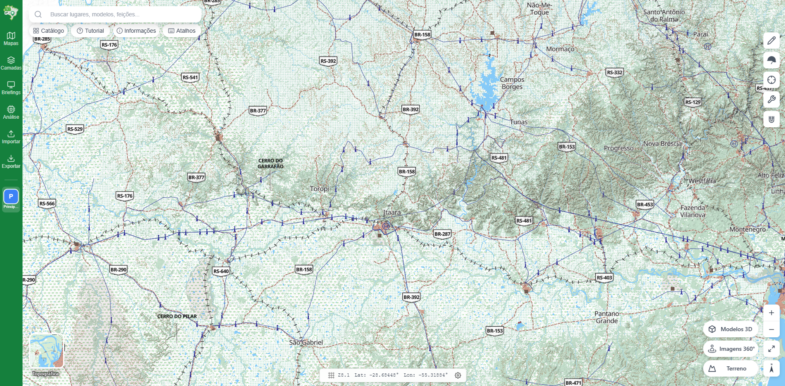

Na página principal, o tutorial será segmentado em módulos.

* Módulo 1: ferramentas gerais
* Módulo 2: painel lateral esquerdo
* Módulo 3: barra de busca
* Módulo 4: painel lateral superior direito de desenho
* Módulo 5: painel lateral inferior direito de ferramentas auxiliares
* Módulo 6: painel inferior de coordenadas
* Módulo 7: uso do Streetview
* Módulo 8: uso de ferramentas no mapeamento 3D
* Módulo 9: briefings (apresentações)
* Módulo 10: processamento e recursos avançados
* Módulo 11: linha do tempo (controle temporal)

### Módulo 1: Ferramentas Gerais

É possível navegar pelo mapa da seguintes formas no computador (nenhuma ferramenta selecionada):

- Botão esquerdo do mouse: ao pressionar e arrastar é possível mover o mapa.
- Ctrl+Botão esquerdo do mouse: ao pressionar e arrastar segurando Ctrl é possível rotacionar e inclinar o mapa.
- Botão direito do mouse: abre as opções de copiar coordenadas e orientar para o norte.
- Botão do meio do mouse: ao rolar o botão do meio do mouse, é possível mudar o zoom do mapa.
- Ctrl+C: Copiar os itens selecionados. É possível selecionar feições, textos e imagens.
- Ctrl+V: Colar as itens copiados.
- Ctrl+Z: Desfazer.
- Ctrl+Y: Refazer.
- Delete (ou Backspace): apaga as feições selecionadas (pede confirmação).
- Esc: cancela a seleção atual e desativa a ferramenta em uso.

#### Seleção de feições

- Clique simples seleciona uma feição.
- Shift+clique adiciona uma feição à seleção; Shift+clique novamente sobre uma feição já selecionada a remove da seleção (alterna).
- Atalho "Q" ativa a seleção por retângulo: arraste uma caixa para selecionar tudo dentro dela.
- Selecionar um grupo seleciona todas as suas feições de uma vez.
- Copiar e colar (Ctrl+C / Ctrl+V) leva junto as imagens associadas e funciona inclusive entre mapas diferentes. A cópia colada aparece com um pequeno deslocamento para facilitar a identificação.

#### Magnetismo (snapping) — Atalho "G"

Ao desenhar, o cursor "gruda" automaticamente em vértices, arestas e extremidades de feições já existentes, facilitando o encaixe preciso. Um indicador visual aparece quando o ponto é capturado. Pressione "G" para ligar ou desligar o magnetismo. Funciona nas ferramentas de desenho (ponto, linha, polígono, retângulo, círculo, elipse, setor) e nas ferramentas militares e de análise; segure Ctrl para inverter temporariamente o estado atual.

#### Edição de vértices

Após criar uma feição com vértices (linha, polígono, elipse, seta, etc.), selecione-a para editar: arraste um vértice para movê-lo, clique no ponto intermediário (no meio de cada segmento) para inserir um novo vértice, e use o botão direito sobre um vértice para removê-lo.

#### Seletor de mapa base

No canto inferior esquerdo há um seletor de mapa de fundo. Clique para expandir e escolher entre as opções disponíveis (carta topográfica, ortoimagem e BDGEx, entre outras). O seletor fica oculto quando o mapa está travado.

### Módulo 2: Painel Lateral Esquerdo

<table>
  <tr>
    <td style="vertical-align: top; width: 15%;">
      
    </td>
    <td style="vertical-align: top;">
      <ul>
        <li><strong>Mapas:</strong> ficam centralizadas as opções de importação.</li>
        <li><strong>Camadas:</strong> onde ficam armazenados as camadas.</li>
        <li><strong>Briefings:</strong> onde ficam as apresentações (story maps).</li>
        <li><strong>Análise:</strong> onde ficam ferramentas para análises geoespaciais.</li>
        <li><strong>Importar:</strong> onde é possível importar arquivos.</li>
        <li><strong>Exportar:</strong> onde é possível exportar produtos finais.</li>
        <li>Uma aba de acesso rápido, que permite ciclar entre os mapas.</li>
      </ul>
    </td>
  </tr>
</table>

#### Mapas

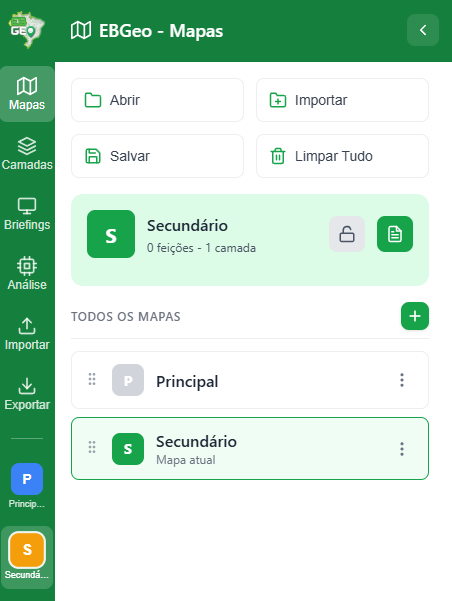

- Abrir: importar um arquivo .ebgeo, nesse caso, todos os mapas já desenhados são substituídos pelos novos mapas importados no .ebgeo.
- Importar: adicionar um arquivo .ebgeo aos mapas já existentes, nesse caso, são criados novos mapas em adição aos já existentes.
- Salvar: permite escolher quais mapas serão salvos no formato .ebgeo.
- Limpar Tudo: deleta todas as informações armazenadas no navegador, não é possível recuperar.

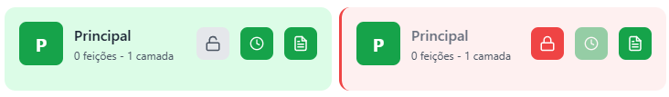

- É possível adicionar notas a um mapa, com título e informações relevantes que ficam armazenadas no .ebgeo.
- É possível travar o mapa, impedindo a realização de alterações.
- É possível ativar o controle temporal do mapa, pelo ícone de relógio (veja abaixo).

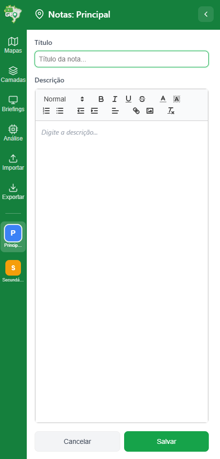

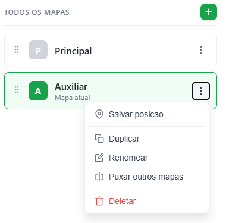

- Salvar Posição: a posição atual do mapa é salva, quando o arquivo .ebgeo for aberto em outra máquina ou o mapa for selecionado no painel, a posição central do mapa vai para a posição salva.
- Duplicar: duplicar o mapa atual, para edição em outro mapa com as informações do mapa anterior.
- Renomear: alterar o nome do mapa atual.
- Puxar outros mapas: puxa as camadas de outro mapa para o mapa atual, permitindo a mescla de dois mapas distintos.
- Reordenar: arraste os mapas na lista para mudar a ordem.
- Deletar: deleta o mapa atual.

##### Controle temporal do mapa

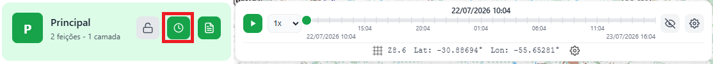

O ícone de **relógio** no card do mapa ativa e desativa o controle temporal daquele mapa: com ele ativo, apenas as feições válidas no instante selecionado ficam visíveis, e a **barra de linha do tempo** aparece na parte inferior da tela. A **engrenagem** da barra abre as configurações temporais.

Consulte o Módulo 11 para o passo a passo completo (validade das feições, trajetórias e configurações temporais).

#### Camadas

Na aba de Camadas, ficam localizadas a análise do terreno (opção de visualizar ou não o sombreamento do terreno) e as feições criadas: pontos, linhas, polígonos, imagens, círculo, etc. Na hierarquia, um mapa pode ter diversas camadas e cada camada pode ter diversas feições, sejam elas repetidas ou não.

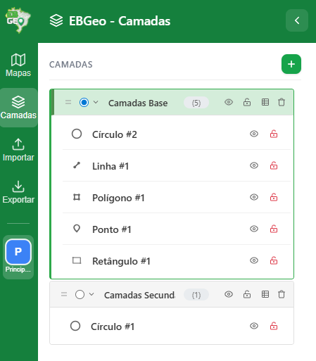

A camada que está selecionada é onde as feições criadas no mapa são criadas. Caso a feição seja criada na camada errada, basta clicar com o botão direito na feição dentro da tela do mapa e selecionar para mover de camada.

Dentro das opções de cada camada é possível marcar para que as feições daquela camada sejam vistas ou não, é possível travar aquele conjunto de camadas, não permitindo a seleção e a edição, é possível consultar a tabela de atributos daquela camada (é uma tabela de atributos compartilhada entre todas as feições daquela camada).

O bloqueio de edição/visualização pode ser feito tanto na camada inteira, quanto individualmente por feição.

As camadas podem ser reordenadas arrastando-as na lista, e as feições podem ser organizadas em grupos (expansíveis e recolhíveis). Os produtos do Catálogo (Modelos 3D, Imagens 360° e camadas de análise) também aparecem integrados nessa árvore.

A opção de deletar, deleta todos as feições daquela camada, sem possibilidade de recuperação.

##### Tabela de atributos

A tabela de atributos da camada permite buscar feições por texto, filtrar por tipo de feição (pontos, linhas, etc.), exibir apenas as feições selecionadas no mapa e editar atributos personalizados diretamente nas células. Clicar com o botão direito no cabeçalho de uma coluna de atributo personalizado abre a opção de remover esse atributo de todas as feições da camada.

#### Briefings

A aba Briefings reúne as apresentações (story maps) do projeto. Cada briefing é uma sequência de slides, e cada slide guarda uma posição de mapa (2D, 3D ou 360°) e um texto explicativo. Consulte o Módulo 9 para o passo a passo de criação e apresentação.

#### Importar

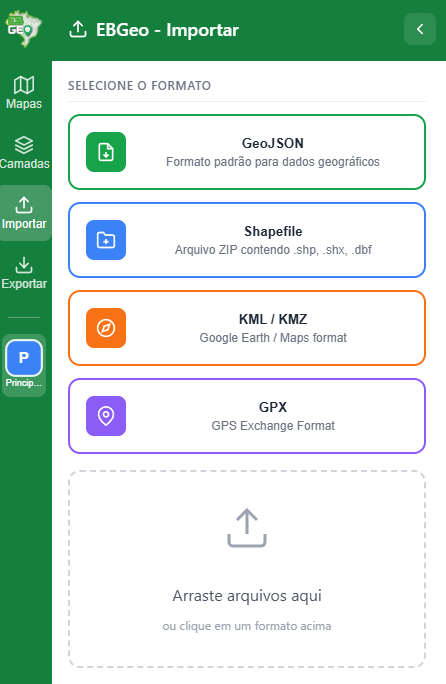

É possível importar dados geoespaciais de outras fontes para dentro do EBGeo: GeoJSON, Shapefile, KML/KMZ, GPX, CSV e Pontos por Coordenadas.

No caso de arquivos CSV (planilhas de coordenadas), o EBGeo detecta o separador automaticamente e permite escolher o formato das coordenadas (Lat/Long em grau decimal, Lat/Long em GMS, MGRS ou UTM) e mapear as demais colunas como atributos das feições.

Também é possível importar simplesmente arrastando o arquivo e soltando sobre a tela do mapa.

Existe um limitador da quantidade de feições que podem ser importadas de uma única vez. Caso a mensagem indique que foi excedido o limite de feições, sugere-se dividir o arquivo que se deseja carregar em mais partes.

<video src="./images/Importar.mp4" controls width="60%"></video>

#### Exportar

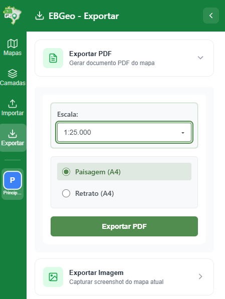

Além da exportação no formato .ebgeo, que permite compartilhar os mapas com outros usuários, é possível também exportar produtos finais.

- Exportar PDF: é possível exportar um arquivo .pdf com todas as feições criadas, o tamanho da folha é padrão (A4) mas a escala é configurável (de 1:1.000 a 1:5.000.000). É possível escolher a qualidade (DPI 150/200/300), a orientação e os elementos cartográficos exibidos (título, legenda, barra de escala, seta norte, grade Lat/Long e grade UTM), com pré-visualização no mapa. Além disso, o .pdf gerado já é georreferenciado, o que permite sua utilização em aplicativos como o Avenza Maps.
- Exportar Garmin: gera um mapa raster compatível com GPS Garmin de mão. Defina a área desejada com dois cliques no mapa.
- Exportar KMZ: gera um mapa como KMZ vetorial para Google Earth, preservando estilo, imagens e atributos. As fotos anexadas aparecem no balão de cada feição.
- Exportar imagem: tira uma captura de tela do EBGeo e salva no formato de imagem, é ideal para ser utilizado em apresentações de slides. Quando os visualizadores 3D ou 360° estão abertos, a captura é feita da cena correspondente.

<video src="./images/Exportar.mp4" controls width="60%"></video>

> A exportação para QAN (Quadro Auxiliar de Navegação) de linhas e polígonos está disponível no menu de contexto (clique direito sobre a feição). Veja o Módulo 4.

### Módulo 3: Barra de Busca

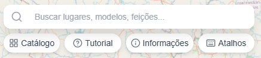

A pesquisa é realizada nos seguintes dados: quaisquer nomes presentes no mapa (cidades, serras, morros, nomes locais, rios, massas d'água), modelos 3D existentes, modelos Streetview, feições já criadas no mapa e coordenadas.

A busca por coordenadas detecta automaticamente vários formatos: Lat/Long em graus decimais, GMS (graus, minutos e segundos), MGRS e UTM. Os resultados aparecem no painel lateral, marcados temporariamente no mapa, e podem ser salvos como feição.

<video src="./images/Buscar.mp4" controls width="60%"></video>

#### Catálogo

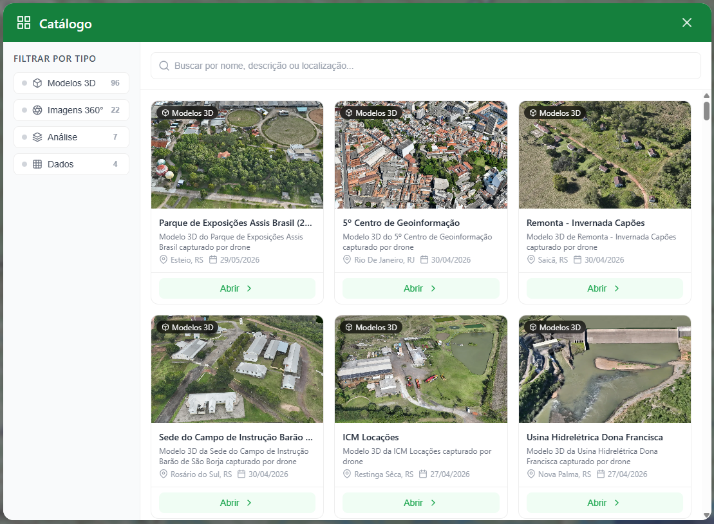

No botão Catálogo (abaixo da barra de busca), o operador pode verificar quais produtos especiais foram construídos, dentre eles: Modelos 3D, Imagens 360° (Streetview), Camadas de Análise (ex.: declividade, trafegabilidade) e Dados das cartas prontas nas diversas escalas. É possível filtrar por categoria, pesquisar pelo nome e, ao clicar em um item, ele é aberto: modelos 3D abrem no visualizador 3D, imagens 360° no visualizador panorâmico, e camadas de análise/dados são adicionadas ao mapa (com enquadramento automático quando a camada possui limites definidos).

#### Tutorial

No botão Tutorial (abaixo da barra de busca), o operador é redirecionado para esse link, onde é possível verificar quais funções estão disponíveis e acessar um breve guia sobre cada ferramenta.

#### Informações

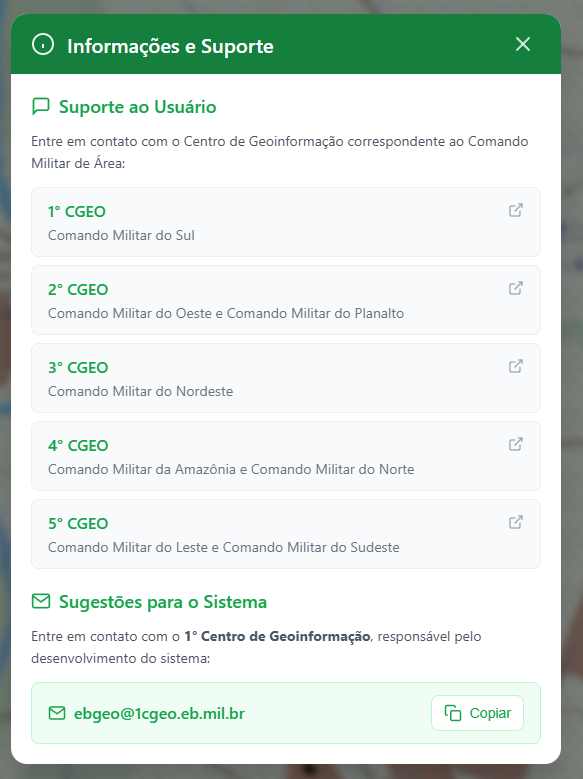

Lista de contatos úteis para retirada de dúvidas, sugestão de melhorias e comunicação de eventuais falhas no sistema.

#### Atalhos

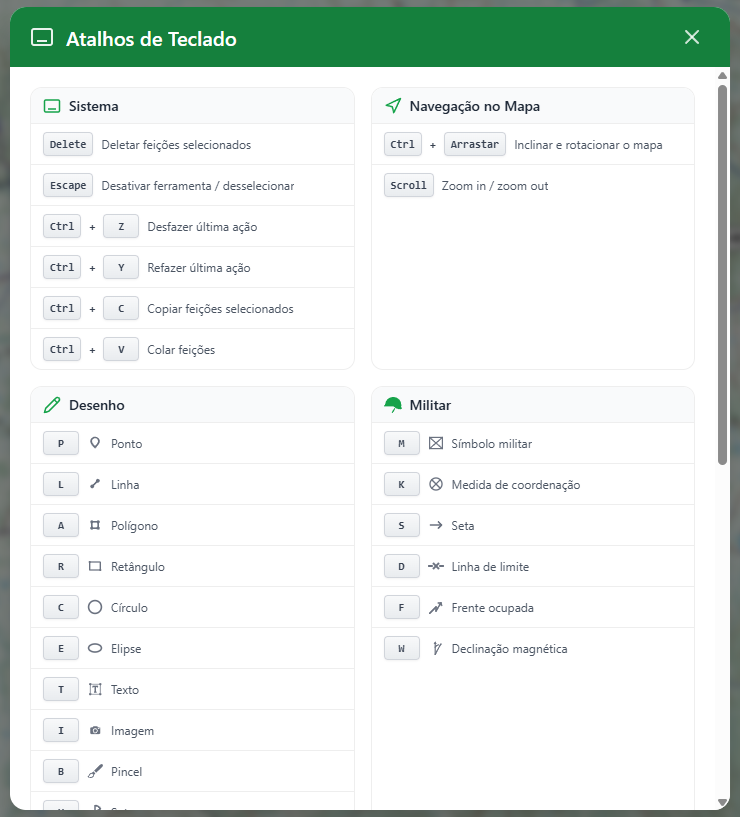

A maioria das ferramentas de desenho do EBGeo possuem atalhos no teclado para melhorar a usabilidade da plataforma. A tabela abaixo lista todos os atalhos disponíveis:

| Tecla | Ferramenta / Ação |
| --- | --- |
| P | Ponto |
| L | Linha |
| A | Área (polígono) (Desenho) e Medir Área (Visualizador 3D) |
| R | Retângulo |
| C | Círculo |
| E | Elipse |
| U | Setor |
| T | Texto |
| I | Imagem |
| B | Pincel |
| M | Simbologia Militar (Militar) e Adicionar marcador (Visualizador 3D) |
| K | Medida de Coordenação |
| S | Seta |
| D | Linha de Limite (Militar) e Medir distância (Visualizador 3D) |
| F | Frente Ocupada |
| W | Declinação Magnética |
| Z | Azimute e Distância |
| O | Linha de Visada (LOS) — requer terreno |
| V | Visibilidade / Viewshed — requer terreno |
| J | Medir Distância |
| H | Medir Área |
| X | Medir Ângulo |
| G | Ligar/desligar magnetismo (snapping) |
| Q | Seleção por retângulo |
| N | Informação de vetor (mapa base) |
| Ctrl+Z / Ctrl+Y | Desfazer / Refazer |
| Ctrl+C / Ctrl+V | Copiar / Colar |
| Delete / Backspace | Excluir seleção |
| Esc | Cancelar seleção / desativar ferramenta |
| Ctrl + Arrastar | Inclinar e rotacionar o mapa|
| Scroll | Zoom in / Zoom out |

### Módulo 4: Painel de Desenho

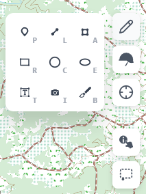

Antes de avançarmos nas ferramentas individuais de desenhos, devemos verificar o painel associado as camadas de desenho.

- Em "Ponto #1" é possível alterar o nome daquela feição
- Em + Adicionar descrição é possível inserir um texto com informações daquela feição, esse texto não aparece no mapa e fica associado a cada feição criada, sem ser um atributo.
- É possível associar fotos e imagens a cada feição criada
- Cada feição e seus tipos tem suas próprias características de estilos, para ponto: alterar o tamanho e a opacidade, mas para linha, tem a possibilidade de alterar a espessura e o padrão da linha. Cada tipo de feição, nesse mesmo painel, recebe a sua possibilidade de estilização.
- Além do estilo, é possível criar atributos que ficam associados a feição e aquele conjunto de camadas. O painel separa "Estilo" e "Atributos" em abas distintas.
- A ferramenta "Definir como padrão" faz com que os próximos desenhos daquele tipo de feição recebem as mesmas características da feição atualmente criada. Para linhas por exemplo: definida uma cor, um padrão de desenho e uma espessura, a próxima linha seguirá o mesmo aspecto.

#### Recursos de estilo comuns

Estes recursos aparecem em várias ferramentas:

- **Padrão de linha**: linhas e bordas podem ser sólidas, tracejadas, pontilhadas ou traço-ponto.
- **Hachura**: o preenchimento de polígonos, círculos, elipses, retângulos e setores pode receber hachuras (horizontal, vertical, diagonal nos dois sentidos, cruzada em + ou em X, ou pontos), com espaçamento e espessura ajustáveis.
- **Correção de zoom**: pontos, textos, imagens, pincel e símbolos militares podem manter o tamanho visual constante independentemente do zoom (ligando a correção de zoom).
- **Etiqueta (label)**: várias feições permitem exibir um texto no mapa, com cor, contorno e tamanho próprios.
- **Medição automática**: o painel exibe o comprimento (linhas) ou a área (formas fechadas) calculados.

#### Desenhos Básicos

Em geral, feições que são possíveis adquirir mais de um vértice, os vértices são adquiridos clicando com o botão esquerdo do _mouse_ e a edição finaliza com o botão direito. Enquanto feições que só tem um ponto inicial e um final, os pontos são adquiridos clicando com o botão esquerdo do _mouse_ e a edição finaliza com o botão esquerdo.

##### Ponto (Atalho "P"), Linha (Atalho "L") e Área (Atalho "A")

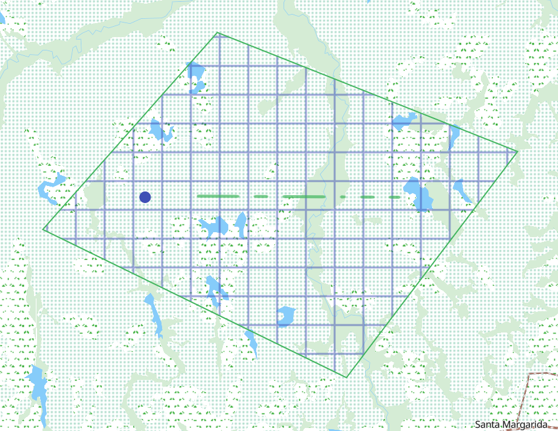

- **Ponto**: pode ser exibido como **marcador** (escolha o símbolo entre as formas círculo, quadrado, losango, triângulo, estrela, cruz ou X, os ícones prontos — veículo, drone, incêndio, armamento, comunicações, aeronave e suprimento — ou um ícone personalizado carregado por você; cor, borda, tamanho e opacidade) ou como **etiqueta** (um texto fixado no mapa; o botão "Preencher com coordenadas" insere a posição automaticamente).
- **Linha**: além de cor, espessura e padrão, pode exibir a **medição** (comprimento total) e o **perfil do terreno** (gráfico de elevação ao longo da linha, quando o terreno está habilitado).
- **Área (polígono)**: preenchimento e borda configuráveis, hachura e exibição da área calculada.

<video src="./images/Pontos.mp4" controls width="49%"></video>
<video src="./images/Linhas.mp4" controls width="49%"></video>
<video src="./images/Poligono.mp4" controls width="49%"></video>

##### Retângulo (Atalho "R"), Círculo (Atalho "C"), Elipse (Atalho "E") e Setor (Atalho "U")

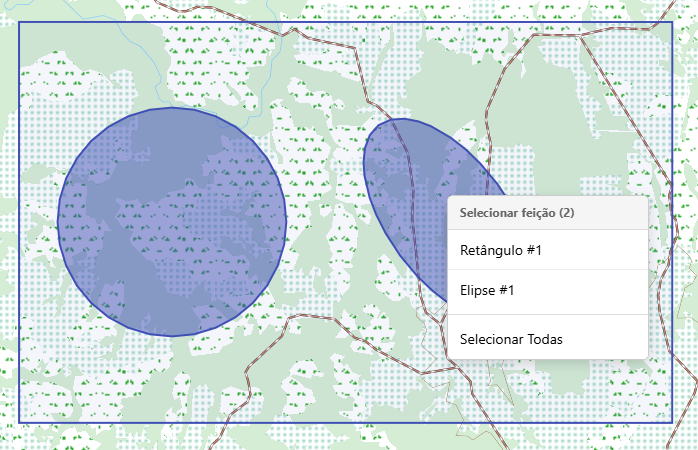

- **Retângulo**: criado com dois cliques (cantos opostos). Permite arredondar os cantos e rotacionar.
- **Círculo**: dois cliques (centro e raio). O raio pode ser ajustado numericamente em metros.
- **Elipse**: definida pelos eixos maior e menor, com rotação ajustável.
- **Setor**: cria um setor angular a partir de um centro, com raio e ângulo de abertura (1° a 359°, padrão 60°). Útil para representar setores de fogo, de vigilância ou de visada.

Todas suportam preenchimento, borda (com padrão de linha), hachura, etiqueta e cálculo de área.

Caso existam feições sobrepostas e elas não estejam travadas no Painel de Camadas, ao selecionar, irá aparecer um painel perguntando qual feição deseja ser editada.

##### Texto (Atalho "T"), Imagem (Atalho "I") e Pincel (Atalho "B")

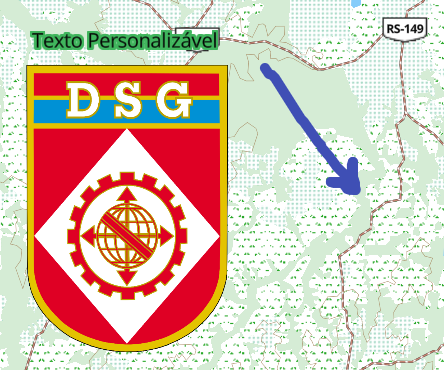

- **Texto**: posicionado com um clique. Permite escolher o tamanho da fonte, cor, alinhamento (em textos de várias linhas), rotação e uma caixa de fundo opcional.
- **Imagem**: carregue um arquivo de imagem (comprimido automaticamente) e posicione no mapa, ajustando tamanho, rotação e opacidade.
- **Pincel**: desenho à mão livre — clique e arraste para traçar. Permite ajustar cor e largura.

<video src="./images/Texto.mp4" controls width="49%"></video>
<video src="./images/Imagens.mp4" controls width="49%"></video>

#### Calcos Militares

##### Simbologia Militar (Atalho "M")

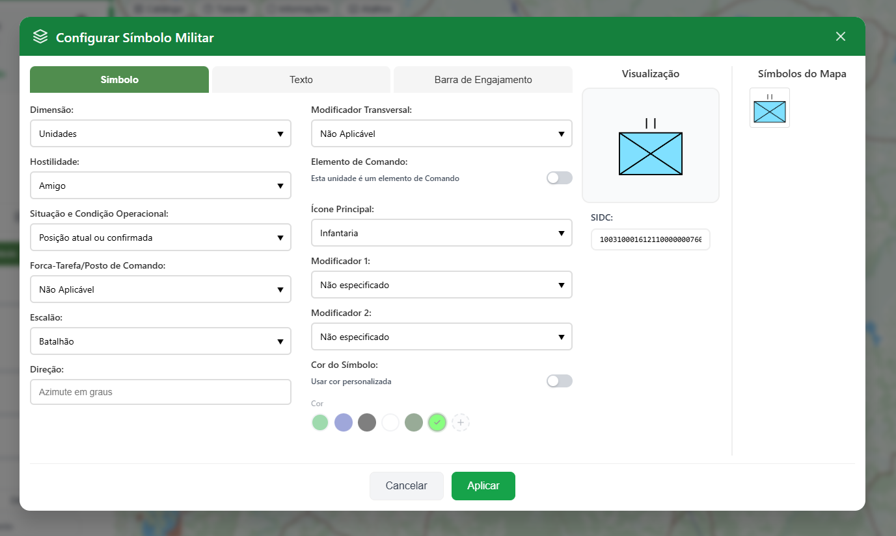

A ferramenta de Simbologia Militar cria símbolos no padrão SIDC 2.0 (App-6/2525). Clique no botão "Configurar Símbolo" para abrir o construtor, que oferece:

- Uma **galeria** ("Símbolos do Mapa") que reúne os símbolos já adicionados ao mapa, ordenados por frequência de uso, para reaproveitamento rápido.
- Abas para definir a **forma** (afiliação, conjunto de símbolos, ícone principal, modificadores e escalão), os **modificadores de texto** (designação, formação superior, quantidade, etc.) e a **barra de engajamento** (esta última disponível apenas para os conjuntos de símbolos que a aceitam).
- Entrada manual do código **SIDC** completo, com validação.
- Pré-visualização em tempo real e escolha de cor.

O símbolo aceita ainda ajuste de tamanho, rotação, opacidade e correção de zoom. Há suporte às extensões brasileiras de simbologia.

<video src="./images/desenho_calunga.mp4" controls width="60%"></video>

##### Medida de Coordenação (Atalho "K")

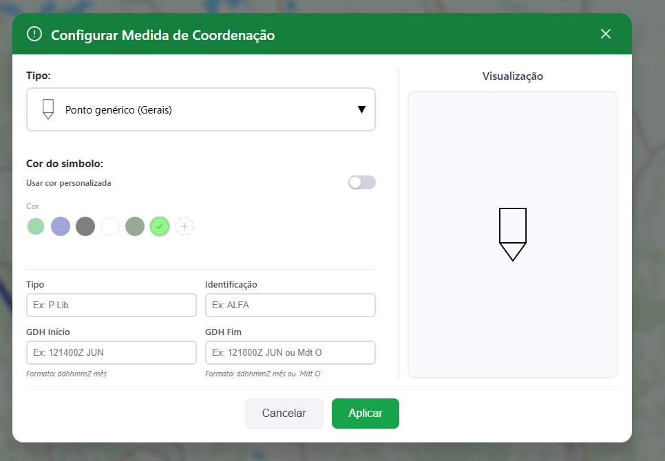

Medidas de coordenação são símbolos pontuais, compostos por um símbolo gráfico e amplificadores de texto. Cada símbolo é posicionado com um clique no mapa.

Ao clicar em "Configurar Símbolo", um catálogo com mais de cem pontos pré-definidos é apresentado, organizado em categorias: gerais, movimento e manobra, passagens (vau, ponte, portada, etc.), fogos, proteção (obstáculos, fortificações, minas, QBRN), logística (classes I a X), controle aéreo e controle marítimo. Para os pontos que aceitam, é possível definir o **escalão** e preencher **modificadores de texto** específicos (identificação, número, classe de suprimento, etc.).

##### Seta (Atalho "S")

A Seta representa movimento ou manobra (eixos de progressão, direção de ataque, deslocamentos). Para desenhar, clique no ponto de origem, mova o cursor (a seta acompanha em pré-visualização) e finalize com o botão direito do mouse no destino; é possível clicar em pontos intermediários para um traçado de vários vértices. A largura é ajustada automaticamente ao zoom. Depois de criada, arraste os pontos brancos (manipuladores) para ajustar o traçado.

No painel é possível configurar:

- Cor de preenchimento e de borda, opacidade e espessura.
- Largura da seta e exibir/ocultar a ponta (a proporção da ponta é ajustada arrastando o manipulador da ponta).
- Modo **aeromóvel** (acrescenta o padrão cruzado no corpo da seta).

Setas podem ser **combinadas** em um único traçado: selecione duas ou mais setas compatíveis e use "Combinar Setas" no menu de contexto; o botão "Separar" desfaz a combinação.

<video src="./images/Seta.mp4" controls width="49%"></video>

##### Ferramenta de Snap (Atalho "G")

A ferramenta de Snap permite ajustar automaticamente a posição de feições ao desenhar ou editar elementos no mapa, garantindo que vértices, segmentos ou pontos coincidam com outras feições existentes. Ao ativar a ferramenta, aproxime o cursor de uma feição compatível para que o encaixe seja realizado automaticamente. O Snap é apenas um botão de liga/desliga (atalho "G"), sem painel de opções: ele captura sempre tanto vértices quanto segmentos, com tolerância e camadas de referência fixas. Esse recurso aumenta a precisão da edição e evita sobreposições, lacunas ou desalinhamentos entre feições.

##### Linha de Limite (Atalho "D")

A Linha de Limite demarca a separação entre unidades (por exemplo, o limite entre dois batalhões). Desenhe clicando em sucessivos vértices e finalize com o botão direito. Ao longo do traçado são desenhados, em intervalos, os **símbolos de escalão**:

- Algarismos romanos para os escalões maiores (XXXX = Exército, XXX = Corpo de Exército, XX = Divisão, X = Brigada, III = Regimento, II = Batalhão, I = Companhia).
- Pontos para os menores (••• = Seção, •• = Grupo de Combate, • = Equipe).

No painel é possível escolher o escalão, a cor, a espessura e a opacidade, e adicionar rótulos de texto acima e abaixo da linha.

Um limite pode ser cortado em dois. Com ele selecionado, escolha "Cortar Linha de Limite" no menu do clique direito (ou no menu da feição, no painel) e clique no ponto do corte; Esc cancela. Cada metade fica com os símbolos de escalão que caíam no seu trecho, e a metade que ficar sem nenhum ganha um símbolo no centro. As duas herdam o escalão, a cor, a espessura, a opacidade e os rótulos do limite original.

##### Frente Ocupada (Atalho "F")

A Frente Ocupada representa uma posição defensiva ocupada, no formato de dois braços em "V" que partem de um ponto central. Para criar, dê dois cliques: o ponto central e a ponta de um dos braços; o segundo braço é gerado automaticamente (ambos desenhados como curvas) e a frente é concluída logo após o segundo clique. No painel ajuste cor, espessura e opacidade. Os três pontos de base podem ser arrastados para reposicionar a frente.

##### Declinação Magnética (Atalho "W")

Insere um diagrama de nortes no mapa, com as setas do norte verdadeiro (NV), do norte de quadrícula (NQ) e do norte magnético (NM), além da declinação magnética (NV-NM) e da convergência meridiana (NV-NQ). O ângulo de declinação é calculado automaticamente (modelo WMM2025) na posição clicada e exibido apenas para consulta; no painel é possível ajustar o tamanho e a opacidade do diagrama. Útil como elemento de orientação em produtos cartográficos.

#### Azimute e Distância (Atalho "Z")

Funciona como uma caderneta de campanha digital. No painel, defina um ponto de referência (clicando no mapa ou digitando as coordenadas) e preencha uma tabela de pernas (azimute + distância). É possível escolher as unidades (graus ou milésimos; metros ou quilômetros), aplicar a declinação magnética (automática, pelo modelo WMM, ou manual) e escolher o modo de saída: **Rota** (gera uma linha ligando todas as pernas), **Ponto** (gera um ponto para o ponto de referência e para o fim de cada perna) ou **Área** (gera um polígono fechando de volta à origem, requer ao menos duas pernas). A feição gerada fica salva no mapa.

#### Medição de Ângulo (Atalho "X")

Permite medir ângulos diretamente no mapa por meio de três cliques sucessivos (extremidade inicial, vértice e extremidade final). O resultado é exibido automaticamente, possibilitando a análise precisa da abertura entre duas direções ou segmentos. O resultado é exibido simultaneamente nas três unidades — graus, milésimos e grados —, facilitando sua utilização em diferentes contextos cartográficos, topográficos e militares.

#### Informação de vetor (Atalho "N")

Permite identificar feições do mapa base (EDGV). Ative a ferramenta e clique sobre um elemento do mapa para ver suas propriedades. Quando houver sobreposição, um menu permite escolher qual feição inspecionar.

#### Menu de contexto (clique direito)

Além de "Copiar coordenadas" e "Orientar para o norte", o clique direito oferece, conforme a seleção, várias ações:

- Criar grupo, combinar grupos e desagrupar feições.
- Combinar setas e separar setas.
- Cortar uma linha em duas: selecione a opção "Cortar Linha" e depois clique sobre a linha no ponto onde deseja cortá-la (Esc cancela). A Linha de Limite tem o mesmo corte, na opção "Cortar Linha de Limite".
- Exportar para QAN (Quadro Auxiliar de Navegação).
- Mover as feições para outra camada ou para outro mapa.
- Dar zoom para a seleção e duplicar a seleção.

### Módulo 5: Painel Auxiliar Direito

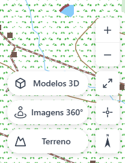

- +: aumenta o zoom no mapa, também pode ser feito com o scroll do mouse.
- -: reduz o zoom no mapa, também pode ser feito com o scroll do mouse.
- Habilitar tela cheia
- Orientar para o norte: reseta a orientação do mapa para o norte, sem inclinação.
- Modelos 3D: habilita no mapa os marcadores 3D, que ao serem clicados abrem um preview e a possibilidade de visualizar o 3D.

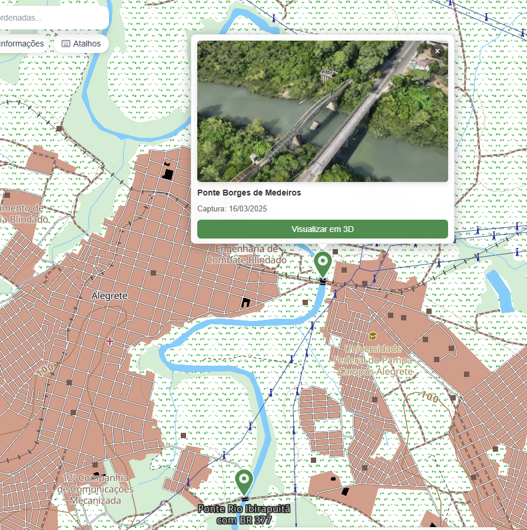

- Imagens 360°: habilita no mapa os marcadores de onde há imagens em 360°.
- Terreno: habilita o terreno, usado para ferramentas de análise de visibilidade, em um pequeno nível afeta a performance da aplicação. Com o terreno ativo, o painel de coordenadas também passa a exibir a elevação do ponto sob o cursor.

#### Ferramentas de análise (requerem o Terreno ativo)

##### Linha de Visada — LOS (Atalho "O")

Avalia se há visada entre dois pontos considerando o relevo. Clique no ponto do observador e depois no ponto do alvo. O trecho **visível** é mostrado em verde e o **obstruído** em vermelho. No painel é possível ajustar a altura do observador e do alvo, a quantidade de pontos de amostragem e visualizar o perfil de elevação. Mover qualquer extremidade recalcula a visada automaticamente.

<video src="./images/LOS_cliques.mp4" controls width="60%"></video>

##### Visibilidade — Viewshed (Atalho "V")

Calcula, a partir de um observador, qual a área visível dentro de um setor. Clique para posicionar o observador e clique novamente para definir o raio e a direção. Uma barra de progresso indica o cálculo. As áreas visíveis aparecem em verde e as bloqueadas em vermelho. No painel ajuste o raio, a abertura do setor e as alturas do observador e do alvo; os manipuladores permitem mudar o raio (alça vermelha) e a abertura (alça azul).

<video src="./images/Viewshed_cliques.mp4" controls width="60%"></video>

#### Ferramentas de medição (efêmeras)

São medições rápidas que não ficam salvas no mapa — mas podem ser convertidas em feição pelo botão "Salvar como feição".

- **Distância (Atalho "J")**: clique para marcar pontos sucessivos; o botão direito finaliza. Mostra a distância de cada trecho e o total. Unidades: metros, quilômetros, milhas náuticas ou pés.
- **Área (Atalho "H")**: desenhe um polígono; mostra a área e o perímetro. Unidades: m², hectares ou km².

<video src="./images/Distance_cliques.mp4" controls width="49%"></video>
<video src="./images/Area_cliques.mp4" controls width="49%"></video>

### Módulo 6: Painel Inferior de Coordenadas

Na parte inferior da tela, o EBGeo exibe em tempo real as coordenadas do ponto sob o cursor, o nível de zoom atual e, quando o Terreno está habilitado, a elevação do ponto.

O ícone de engrenagem permite alternar o **formato das coordenadas**:

- Lat/Long em graus decimais (ex.: `-22.45592°, -44.44966°`).
- Lat/Long em GMS — graus, minutos e segundos (com a convenção brasileira L/O para Leste/Oeste).
- UTM (WGS84).
- MGRS.

#### Grade

A partir do mesmo painel é possível ativar uma **grade** sobreposta ao mapa, nos formatos **Lat/Long** ou **UTM**, em escalas de 250k, 100k, 50k e 25k (exibida a partir de um zoom mínimo). O estado da grade é salvo por mapa. Para desligar, selecione a opção "Desligar".

### Módulo 7: Uso do Streetview (Imagens 360°)

Ative "Imagens 360°" no painel auxiliar direito para exibir os marcadores das fotos panorâmicas. Clique em um marcador para ver o preview e entrar na visualização 360°.

<video src="./images/StreetView.mp4" controls width="60%"></video>

#### Navegação dentro da cena

- **Mouse**: clique e arraste para girar a vista.
- **Teclado**: setas ou W/A/S/D para olhar ao redor; +/− para aproximar/afastar (zoom/FOV).
- Os marcadores brancos próximos representam outras fotos: clique para "andar" até elas.
- Um **mini-mapa** sincronizado mostra sua posição e permite navegar clicando nele.

#### Marcadores e ferramentas na cena

É possível adicionar marcadores (pontos de interesse) dentro da imagem 360°. Cada marcador tem nome, descrição, estilo (cor, tamanho, etiqueta) e fotos associadas. A orientação da câmera pode ser salva pelo botão "Salvar orientação" (ou tecla O) e é restaurada ao retornar à mesma foto. Há também um botão para capturar uma imagem (screenshot) da cena em Exportar Imagem.

### Módulo 8: Uso de Ferramentas no Mapeamento 3D

Ative "Modelos 3D" no painel auxiliar direito para exibir os marcadores dos modelos. Clique em um marcador para ver o preview e abrir a visualização 3D (Cesium) em tela cheia.

Navegue com o mouse (arrastar para girar/deslocar, roda para zoom, botão direito para inclinar) e com o teclado. A barra de ferramentas do visualizador 3D oferece:

- **Marcador 3D**: clique sobre a superfície do modelo para criar um ponto de anotação. Edite nome, descrição, localização (em vários formatos), estilo do marcador e da etiqueta, e fotos.
- **Medição 3D**: meça **distância** ou **área** sobre o modelo, com resultado e estilo configuráveis.
- **Viewshed 3D**: defina um observador e um cone de visão (campo horizontal, distância e altura do observador) para visualizar as áreas visíveis e bloqueadas.
- **Salvar câmera**: guarda a posição atual da câmera para restaurá-la depois.
- **Screenshot**: captura a cena 3D como imagem.

Os marcadores, medições e viewsheds criados no 3D também aparecem no mapa 2D, mantendo os dois ambientes sincronizados.

### Módulo 9: Briefings (Apresentações)

O Briefing permite montar apresentações navegáveis (story maps) combinando mapa 2D, modelos 3D e imagens 360°.

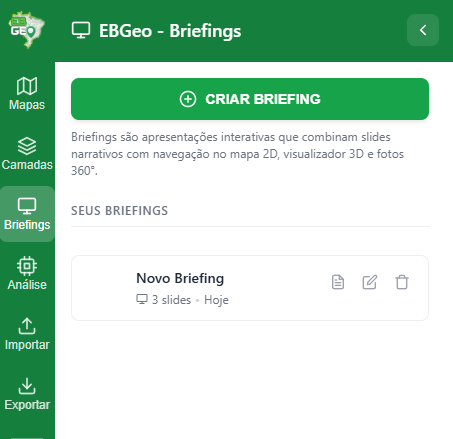

#### Criar e editar

Na aba **Briefings** do painel lateral esquerdo, crie um novo briefing. No editor:

- Adicione slides; ao criar um slide, a **posição atual** é capturada automaticamente (enquadramento do mapa 2D, câmera 3D ou orientação 360°, conforme o que estiver ativo).
- Escreva o texto de cada slide em um editor de texto formatado.
- Reordene os slides arrastando, renomeie ou exclua.
- Importe a nota do mapa para o conteúdo do slide atual, ou importe slides de outro briefing.

#### Apresentar

No modo de apresentação, o briefing ocupa a tela inteira e troca automaticamente entre os ambientes (2D, 3D, 360°) a cada slide, exibindo o texto correspondente. Atalhos:

| Tecla | Ação |
| --- | --- |
| → ou D | Próximo slide |
| ← ou A | Slide anterior |
| Home / End | Primeiro / último slide |
| F | Alternar tela cheia |
| Esc | Sair da apresentação |

Um briefing também pode ser exportado como PDF (uma página por slide).

### Módulo 10: Processamento e Recursos Avançados

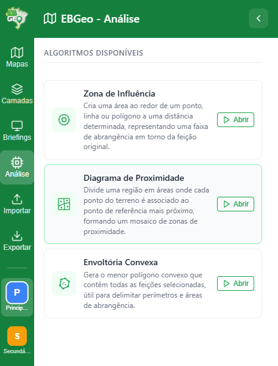

#### Processamento geoespacial

O EBGeo inclui algoritmos de análise que recebem as feições selecionadas (ou de uma camada) e geram um novo polígono de resultado:

- **Zona de Influência**: cria uma área ao redor de um ponto, linha ou polígono a uma distância determinada (em metros), representando uma faixa de abrangência em torno da feição original.
- **Zonas de Proximidade**: divide uma região em áreas onde cada ponto do terreno fica associado ao ponto de referência mais próximo, formando um mosaico de zonas de proximidade.
- **Contorno Externo**: cria a menor área que envolve todas as feições selecionadas, como um elástico esticado em volta dos pontos. Útil para delimitar perímetros e áreas de abrangência.

### Módulo 11: Linha do Tempo (Controle Temporal)

O EBGeo permite dar uma dimensão temporal ao mapa: cada feição pode ter uma **validade no tempo** (quando aparece e desaparece) e feições móveis (pontos, símbolos militares e medidas de coordenação) podem ter uma **trajetória** que as desloca ao longo do tempo. É ideal para representar a evolução de uma operação hora a hora ou dia a dia.

#### Ativar o controle temporal

No card do mapa atual (aba **Mapas**), clique no botão de **relógio** para ativar o controle temporal daquele mapa. Uma **barra de linha do tempo** aparece na parte inferior da tela. O botão fica desabilitado quando o mapa está travado.

<video src="./images/Controle_Temporal.mp4" controls width="60%"></video>

#### A barra de linha do tempo

- **Reproduzir/Pausar**: anima o cursor ao longo do intervalo, mostrando feições e trajetórias evoluindo no tempo.
- **Velocidade**: seletor da velocidade de reprodução.
- **Cursor (régua)**: arraste para navegar até um instante específico; as setas ← → do teclado avançam/retrocedem um passo (a unidade configurada). A régua exibe o instante atual.
- **Olho (modo revelar)**: mostra temporariamente as feições que estariam ocultas fora do intervalo atual — útil durante a edição, sem precisar mover o cursor.
- **Engrenagem (configurações)**: abre as configurações temporais do mapa.

Cada usuário navega sua própria linha do tempo: reproduzir, pausar e mover o cursor são ações locais e não afetam os demais.

#### Configurações temporais

Na engrenagem da barra, defina:

- **Unidade de divisão**: minuto, hora, dia ou semana (granularidade da régua e do passo do cursor).
- **Modo**: **Absoluto** (datas e horas reais) ou **Relativo** (offsets militares D+N a partir de uma origem).
- **Início/Fim do mapa**: os limites do intervalo. Em branco, são deduzidos automaticamente das feições.
- **Data de D (origem)**: a referência para o eixo D+N no modo relativo. Ela apenas **rotula** a régua — não move as feições.
- **Reagendar feições**: ação explícita que **desloca todas as feições e trajetórias no tempo** para que o Dia D caia em outra data real, mantendo os offsets D+N. Use ao reprogramar a operação (não pode ser desfeito).

#### Validade temporal das feições

No painel de qualquer feição há a seção **Validade temporal**, com os campos **Início** e **Fim**. A feição só fica visível enquanto o cursor estiver dentro dessa janela. Campos em branco significam **permanente** (visível em qualquer instante). Os valores podem ser informados como data/hora exata ou como offset (D+N), conforme o modo.

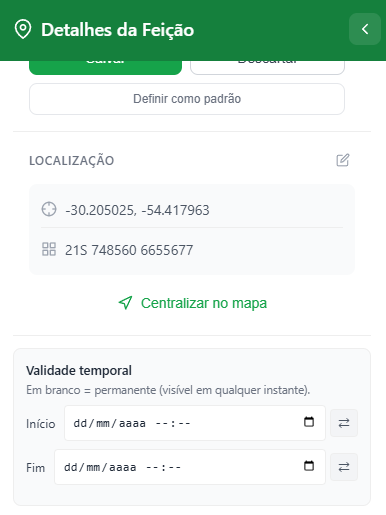

#### Trajetórias (feições móveis)

Pontos, símbolos militares e medidas de coordenação podem receber uma **Trajetória** — uma sequência de pontos-chave, cada um com um instante associado. Durante a reprodução, a feição se move suavemente interpolando entre eles.

A trajetória é editada no mapa, de forma análoga à ferramenta de linha:

- **Adicionar no mapa**: entra no modo de adição — cada clique acrescenta um ponto-chave ao final da trajetória, um passo de tempo após o ponto-chave anterior (estendendo o caminho para a frente no tempo). Uma barra de "Cancelar / Concluir" aparece no topo.
- **Mover** um ponto-chave: arraste o manipulador (mantém o instante daquele ponto).
- **Inserir**: clique no manipulador intermediário de um segmento (o instante é a média dos vizinhos).
- **Remover**: botão direito sobre um ponto-chave.

O painel da feição mostra estatísticas da trajetória (número de pontos, duração e distância) e permite saltar o cursor para cada ponto-chave.

#### Atributos automáticos (Simbologia Militar e Medida de Coordenação)

Símbolos militares e medidas de coordenação com trajetória podem ter atributos **derivados automaticamente** do movimento, por meio dos "Vínculos automáticos" no painel:

- **Direção**: a direção de deslocamento, calculada a partir da trajetória no instante atual.
- **Velocidade**: a velocidade do trecho atual.
- **GDH/DTG**: o grupo data-hora, derivado da janela de validade temporal.

Esses vínculos são opcionais (desligados por padrão) e atualizam o símbolo conforme a reprodução avança. A **rotação** do símbolo permanece sempre manual.
