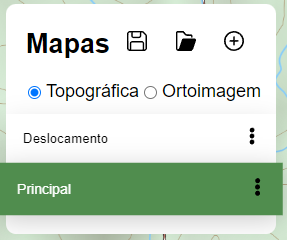

# Tutorial

Esta página tem como objetivo explicar as funcionalidades do EBGEO, bem como oferecer diretrizes para a sua utilização.

## SIG

Nessa aba é possível visualizar um mapa digital e realizar algumas análises com as ferramentas disponibilizadas. As imagens, terrenos e vetores foram gerados pela DSG. É possível ainda visualizar algumas vias com imagens 360º.

### Controles para Navegação

É possível navegar pelos mapa da seguinte forma no computador (nenhuma ferramenta selecionada):

- Botão esquerdo do mouse: ao pressionar e arrastar é possível mover o mapa.
- Botão direito do mouse: ao pressionar e arrastar é possível mudar a perspectiva e rotacionar o mapa.
- Botão do meio do mouse: ao rolar o botão do meio do mouse, é possível mudar o zoom do mapa.

<!-- 
- Ctrl+C: Copiar os itens selecionados. É possível selecionar [Feições](#criar-feição), [Textos](#adicionar-texto) e [Imagens](#adicionar-imagem).
- Ctrl+V: Colar as itens copiados.  
-->
- Ctrl+Botão esquerdo do mouse: ao pressionar e arrastar segurando Ctrl é possível rotacionar o mapa.
- Ctrl+Z: Desfazer.
- Ctrl+Y: Refazer.

> Obs.: Ao clicar em  o mapa é orientado para o norte e retorna à visão 2D.

<iframe width="1280" height="548" src="https://www.youtube.com/embed/j-RMf5LTX4c" title="EBGEO Web #1 - Controles do SIG" frameborder="0" allow="accelerometer; autoplay; clipboard-write; encrypted-media; gyroscope; picture-in-picture; web-share" referrerpolicy="strict-origin-when-cross-origin" allowfullscreen></iframe>

### Ferramentas

As ferramentas não estão disponíveis na versão para celular.

#### Exportar dados

Salva os mapas carregados e feições em um arquivo.

> Obs.: Ao exportar, todos os mapas são salvos no arquivo. É possível salvar a posição atual para, quando importar, reenquadrar o mapa na posição salva.

<iframe width="1280" height="548" src="https://www.youtube.com/embed/1nlQID48P-Y" title="EBGEO Web #2 - Exportar Dados" frameborder="0" allow="accelerometer; autoplay; clipboard-write; encrypted-media; gyroscope; picture-in-picture; web-share" referrerpolicy="strict-origin-when-cross-origin" allowfullscreen></iframe>

---

#### Importar dados

Carrega os mapas e feições salvas a partir de um arquivo gerado por "Exportar dados".

> Obs.: Arquivo de exemplo para importação:

<a href='http://localhost:8080/docs/exemplos/exemplo-tutorial.ebgeo' download style='font-size:25px'>Arquivo exemplo</a>

<iframe width="1280" height="548" src="https://www.youtube.com/embed/xhPxX0nR8LM" title="EBGEO Web #3 - Importar Dados" frameborder="0" allow="accelerometer; autoplay; clipboard-write; encrypted-media; gyroscope; picture-in-picture; web-share" referrerpolicy="strict-origin-when-cross-origin" allowfullscreen></iframe>

---

#### Gerenciador de mapas

Permite Criar, alterar, copiar, excluir e renomear mapas, além de salvar posição atual do mapa e alterar visualização entre carta Topográfica e Ortoimagem.

Nesse contexto, os mapas são conjunto de feições criadas pelo usuário e o tipo (Carta ou Ortoimagem) associados àquele mapa.

<iframe width="1280" height="548" src="https://www.youtube.com/embed/qtymCKc986U" title="EBGEO Web #4 - Gerenciador de mapas" frameborder="0" allow="accelerometer; autoplay; clipboard-write; encrypted-media; gyroscope; picture-in-picture; web-share" referrerpolicy="strict-origin-when-cross-origin" allowfullscreen></iframe>

---

##### Alterar camada base

- Topográfica: visualização estilo carta topográfica
- Ortoimagem: visualização estilo carta ortoimagem

---

##### Criar novo mapa

Adiciona novo mapa ao gerenciador. Ao clicar será perguntado o nome do novo mapa.

---

##### Alternar mapa

Ao clicar no nome do mapa, será alterado o mapa, incluindo o tipo (Carta ou Ortoimagem) e feições carregadas.

---

##### Salvar posição

Opção disponível ao clicar nos 3 pontos verticais ao lado do nome do mapa.

Salva a posição atual do mapa para quando alterar novamente para o mapa cuja posição foi salva, ele será reenquadrado. Essa informação também é exportada com os mapas.

---

##### Copiar mapa

Opção disponível ao clicar nos 3 pontos verticais ao lado do nome do mapa.

Copia o mapa selecionado.

---

##### Renomear

Opção disponível ao clicar nos 3 pontos verticais ao lado do nome do mapa.

Permite renomear o mapa selecionado.

---
##### Excluir mapa

Opção disponível ao clicar nos 3 pontos verticais ao lado do nome do mapa.

Exclui o mapa selecionado.

---

#### Buscar feição

Na caixa de pesquisa é possível buscar por feições no mapa. Digitando o nome da feição, irá mostrar as feições correspondente ao termo pesquisado. Ao lado do nome da feição tem o tipo da feição, exemplo: Morro, Rio, Público militar, etc. Ao escolher a feição, o mapa é reenquadrado para a feição selecionada e um marcador indica o local da feição.

<iframe width="1280" height="548" src="https://www.youtube.com/embed/wmfCbX7h2tM" title="EBGEO Web #5 - Buscar Feição" frameborder="0" allow="accelerometer; autoplay; clipboard-write; encrypted-media; gyroscope; picture-in-picture; web-share" referrerpolicy="strict-origin-when-cross-origin" allowfullscreen></iframe>

---
#### Inspecionar feição do mapa base

Com a ferramenta ativada, é possível clicar numa feição do mapa base para ver os atributos da feição.

---

#### Manipular feições

##### Linha

Com a ferramenta selecionada é possível adquirir uma linha no mapa clicando com o botão esquerdo do _mouse_. É possível finalizar a edição ao clicando no último vértice adquirido. 

Ao finalizar a edição ou ao clicar novamente na feição, a feição é selecionada (indicado por uma linha vermelha pontilhada ao redor da linha). E é possível alterar as seguintes propriedades:

- Tamanho
- Cor
- Opacidade
- Medir: mostra o tamanho da linha como um texto flutuante na linha
- Perfil do terreno: mostra um gráfico com o perfil do terreno da linha selecionada
- Salvar: salva as alterações
- Descartar: descarta as alterações
- Definir padrão: define o estilo padrão para as próximas linhas adquiridas
- Deletar: exclui as feições selecionadas

<iframe width="1280" height="548" src="https://www.youtube.com/embed/s_VMEUmNFuM" title="EBGEO Web #6 - Adicionar linha" frameborder="0" allow="accelerometer; autoplay; clipboard-write; encrypted-media; gyroscope; picture-in-picture; web-share" referrerpolicy="strict-origin-when-cross-origin" allowfullscreen></iframe>

---

##### Polígono

Com a ferramenta selecionada é possível adquirir um polígono no mapa clicando com o botão esquerdo do _mouse_. É possível finalizar a edição ao clicando no último vértice adquirido. 

Ao finalizar a edição ou ao clicar novamente na feição, a feição é selecionada (indicado por uma linha vermelha pontilhada ao redor do polígono). E é possível alterar as seguintes propriedades:

- Cor
- Opacidade
- Cor da borda
- Largura da borda
- Medir: mostra a área do polígono como um texto flutuante no polígono
- Salvar: salva as alterações
- Descartar: descarta as alterações
- Definir padrão: define o estilo padrão para os próximos polígonos adquiridas
- Deletar: exclui as feições selecionadas

<iframe width="1280" height="548" src="https://www.youtube.com/embed/wWi1J33ROPU" title="EBGEO Web #7 - Adicionar polígono" frameborder="0" allow="accelerometer; autoplay; clipboard-write; encrypted-media; gyroscope; picture-in-picture; web-share" referrerpolicy="strict-origin-when-cross-origin" allowfullscreen></iframe>

---

##### Ponto

Com a ferramenta selecionada é possível adquirir um ponto no mapa clicando com o botão esquerdo do _mouse_.

Ao adquirir o ponto ou ao clicar novamente na feição, a feição é selecionada (indicado por uma linha vermelha pontilhada ao redor do ponto). E é possível alterar as seguintes propriedades:

- Tamanho
- Cor
- Opacidade
- Salvar: salva as alterações
- Descartar: descarta as alterações
- Definir padrão: define o estilo padrão para os próximos pontos adquiridas
- Deletar: exclui as feições selecionadas

<iframe width="1280" height="548" src="https://www.youtube.com/embed/yn9RbCugcx4" title="EBGEO Web #8 - Adicionar ponto" frameborder="0" allow="accelerometer; autoplay; clipboard-write; encrypted-media; gyroscope; picture-in-picture; web-share" referrerpolicy="strict-origin-when-cross-origin" allowfullscreen></iframe>

---

``Para selecionar uma feição basta clicar nela``

> Obs.:  É possível selecionar e alterar mais de uma feição segurando o Shift.

``Para editar uma feição, inclusive adicionar vértices, clique numa feição já selecionada`` 

``Para mover uma feição, selecione a feição, clique nela e arraste-a`` 

#### Adicionar texto

- Adicionar textos personalizados no mapa.

Com a ferramenta ativada, clique num local do mapa para adicionar um texto.

Para editar o texto adicionado, clique no texto.

É possível alterar as seguintes propriedades:

- Texto
- Tamanho
- Cor
- Rotação
- Justificativa: justifica o texto com mais de uma linha conforme as opções (esquerda (L), centralizado (C), direita (R))
- Cor da borda
- Salvar: salva as alterações
- Descartar: descarta as alterações
- Definir padrão: define o estilo e texto padrão para os próximos textos adquiridas
- Deletar: exclui as feições selecionadas

<iframe width="1280" height="548" src="https://www.youtube.com/embed/90ePWb5JbC4" title="EBGEO Web #9 - Adicionar texto" frameborder="0" allow="accelerometer; autoplay; clipboard-write; encrypted-media; gyroscope; picture-in-picture; web-share" referrerpolicy="strict-origin-when-cross-origin" allowfullscreen></iframe>

---

#### Adicionar imagem

Clique na ferramenta para ativá-la e no mapa para adicionar uma imagem. Será aberto uma janela para escolher a imagem.

Ao selecionar a imagem será aberta a caixa de opções onde é possível alterar as seguintes propriedades:

- Tamanho
- Rotação
- Opacidade
- Salvar: salva as alterações
- Descartar: descarta as alterações
- Deletar: exclui as feições selecionadas

> Obs.: Para montar um símbolo militar acesse o [Portal de Simbologia Militar](https://simbologia.eb.mil.br/)

<iframe width="1280" height="548" src="https://www.youtube.com/embed/WMNXl1AOdeA" title="EBGEO Web #10 - Adicionar Imagens" frameborder="0" allow="accelerometer; autoplay; clipboard-write; encrypted-media; gyroscope; picture-in-picture; web-share" referrerpolicy="strict-origin-when-cross-origin" allowfullscreen></iframe>

---

#### Adicionar linha de visada

Clique uma vez no mapa para selecionar o ponto do observador e outra vez no mapa para selecionar o ponto final da visada.

Será gerada uma linha vermelha onde não puder ser visto pelo observador e verde onde é possível ser visualizado pelo observador.

Ao selecionar a linha será aberta a caixa de opções onde é possível alterar as seguintes propriedades:

- Opacidade
- Largura
- Mostrar tamanho:  mostra o tamanho da linha como um texto flutuante na linha
- Mostrar perfil: mostra um gráfico com o perfil do terreno e a linha de visada da linha selecionada
- Salvar: salva as alterações
- Descartar: descarta as alterações
- Deletar: exclui as feições selecionadas

<iframe width="1280" height="548" src="https://www.youtube.com/embed/AKBMFXQsapA" title="EBGEO Web #11 - Adicionar linha de visada" frameborder="0" allow="accelerometer; autoplay; clipboard-write; encrypted-media; gyroscope; picture-in-picture; web-share" referrerpolicy="strict-origin-when-cross-origin" allowfullscreen></iframe>

---

#### Adicionar análise de visibilidade

Clique uma vez no mapa para selecionar o ponto do observador e outra vez no mapa para selecionar o ponto final da visada.

Será gerada um polígono (setor de um círculo) cos as cores: vermelha onde não puder ser visto pelo observador e verde onde é possível ser visualizado pelo observador.

Ao selecionar o setor será aberta a caixa de opções onde é possível alterar as seguintes propriedades:

- Opacidade
- Salvar: salva as alterações
- Descartar: descarta as alterações
- Deletar: exclui as feições selecionadas

<iframe width="1280" height="548" src="https://www.youtube.com/embed/JzTCZ0uldNE" title="EBGEO Web #12 - Adicionar análise de visibilidade" frameborder="0" allow="accelerometer; autoplay; clipboard-write; encrypted-media; gyroscope; picture-in-picture; web-share" referrerpolicy="strict-origin-when-cross-origin" allowfullscreen></iframe>

---

#### Adicionar street view

Ao selecionar a ferramenta, será realçado no mapa onde é possível visualizar as imagens 360°. Ao clicar na via realçada, será possível visualizar as imagens 360° naquela via.

Para navegar nas imagens 360°:

- Clique com o botão esquerdo do mouse em qualquer lugar da imagem para arrasta-la.
- Clique nas setas de navegação para ir para a próxima imagem ou para a imagem anterior.

<iframe width="1280" height="548" src="https://www.youtube.com/embed/tlL6gLOAe1Q" title="EBGEO Web #13 - Adicionar street view" frameborder="0" allow="accelerometer; autoplay; clipboard-write; encrypted-media; gyroscope; picture-in-picture; web-share" referrerpolicy="strict-origin-when-cross-origin" allowfullscreen></iframe>

---

## 3D

Nessa aba é possível visualizar os modelos 3D disponibilizados. Além disso há uma imagem de fundo e um modelo digital de superfície. As ferramentas disponibilizadas funcionam apenas nos modelos 3D, não funcionam no terreno.

### Controles para Navegação

É possível navegar pelos modelos 3D da seguinte forma (nenhuma ferramenta selecionada):

- Botão esquerdo do mouse: ao pressionar e arrastar é possível mover o mapa.
- Botão direito do mouse: ao pressionar e arrastar é possível mudar a perspectiva e rotacionar o mapa.
- Botão do meio do mouse: ao rolar o botão do meio do mouse, é possível mudar o zoom do mapa.

### Modelos 3D

É possível enquadrar os modelos na tela clicando nos seus respectivos botões. São disponibilizados os seguintes modelos 3D:

- AMAN

- AMAN PCL 

### Ferramentas

São disponibilizadas as seguintes ferramentas:

> Obs.: As ferramentas não estão disponíveis na versão para celular.

#### Viewshed

Clicar com o botão esquerdo uma vez no ponto inicial (ponto simulando o observador), clicar com o botão esquerdo outra vez no ponto final. Será gerado um setor esférico e o modelo 3D será colorido dentro do setor com vermelho onde não puder ser visto pelo observador e verde onde é possível ser visualizado pelo observador. Apertar Limpar para limpar o setor já criado, inicializar a ferramenta novamente para criar outro setor.

<iframe width="1280" height="548" src="https://www.youtube.com/embed/xpHFoQk_ywQ" title="EBGEO Web #14 - Viewshed" frameborder="0" allow="accelerometer; autoplay; clipboard-write; encrypted-media; gyroscope; picture-in-picture; web-share" referrerpolicy="strict-origin-when-cross-origin" allowfullscreen></iframe>

---

#### Medição de Distância

Clicar com o botão esquerdo uma vez no ponto inicial, clicar com o botão esquerdo outras vezes para verificar a distancia em linha reta com relação ao ponto anterior. Clicar com o botão direito do mouse para finalizar a medição. Apertar Limpar para limpar as medições em tela, inicializar a ferramenta novamente para outras medições.

<iframe width="1280" height="548" src="https://www.youtube.com/embed/qx5Bdavvj_0" title="EBGEO Web #15 - Medição de Distância" frameborder="0" allow="accelerometer; autoplay; clipboard-write; encrypted-media; gyroscope; picture-in-picture; web-share" referrerpolicy="strict-origin-when-cross-origin" allowfullscreen></iframe>

---

#### Medição de Área

Clicar com o botão esquerdo uma vez no ponto inicial, clicar com o botão esquerdo outras vezes para construir o polígono cuja áre será calculada, clicar com o botão direito para encerrar a construção do polígono e calcular a área. Apertar Limpar para limpar as medições em tela, inicializar a ferramenta novamente para medir novamente.

<iframe width="1280" height="548" src="https://www.youtube.com/embed/QqWvk5e0X0A" title="EBGEO Web #16 - Medição de Área" frameborder="0" allow="accelerometer; autoplay; clipboard-write; encrypted-media; gyroscope; picture-in-picture; web-share" referrerpolicy="strict-origin-when-cross-origin" allowfullscreen></iframe>

---

#### Limpar

Limpar as medições em tela das outras ferramentas.